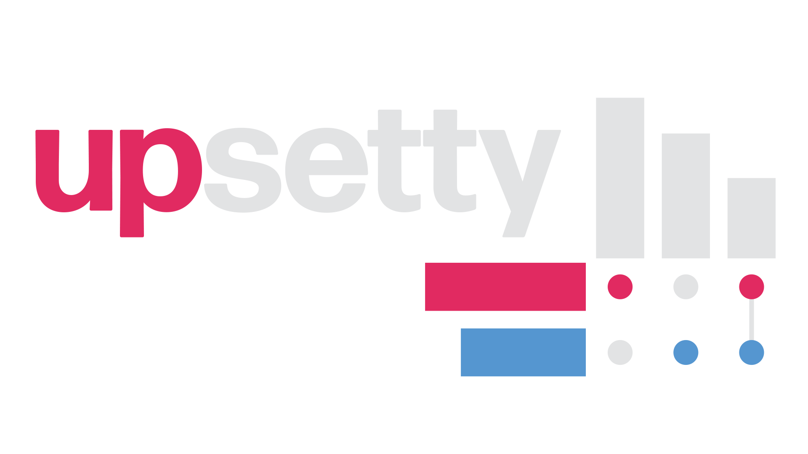

<div align="center">
    

</div>

<p align="center">
    
    
</p>


# 📖 Table of Contents

1. [🧮 What is upsetty?](#🧮-what-is-upsetty)
    1. [What's an Upset Plot?](###what's-an-upset-plot?)
    2. [Why create Upsetty?](###why-create-upsetty?) 
2. [🚀 Quickstart](#🚀-quickstart)
    1. [Installation](###installation)
    2. [Usage](###usage)
3. [📌 Future Plans](#📌-future-plans)

# 🧮 What is upsetty? 

Python package for creating [UpSet plots](https://en.wikipedia.org/wiki/UpSet_Plot) using [Plotly](https://github.com/plotly/plotly.py).

### What's an UpSet Plot?

An UpSet plot is a diagram used to quantitatively visualize sets and their interactions. They are particularly useful visuals for determining the overlap between different groups, as an alternative to [Venn](https://en.wikipedia.org/wiki/Venn_diagram) or [Euler diagrams](https://en.wikipedia.org/wiki/Euler_diagram), which can become cluttered and hard to read with more than a few sets. 

### Why create upsetty?

Currently, the number of tools to create UpSet plots is very limited. Indeed, many of the previous packages for creating these plots have been deprecated or verbose. To that end, we offer **upsetty** as a lightweight, easy-to-use alternative for analyzing overlapping sets in Python.

# 🚀 Quickstart

### Installation

```
pip install upsetty
```

### Usage

```
from upset import Upset
```

To create an UpSet plot, we structure the data like this: 

```
import pandas as pd

# create sample data ({'class_name': [boolean indicators]})
data = {
    'Class A': [True, True, True, False, False, True],
    'Class B': [True, True, True, True, True, False],
    'Class C': [False, False, False, True, True, True]
}

# convert sample data dict to pd.DataFrame
df = pd.DataFrame(data)
```

Then, simply pass the DataFrame to the `generate_plot` method to create a Plotly figure of an UpSet plot.

```
# create UpSet figure
upset = Upset.generate_plot(df)

# show the figure
upset.show()
```

Using the sample data provided above, the output is pictured below:

<p align="center">
    
</p>

> [!NOTE]  
> If you're having trouble getting the output pictured above, you can run the demo script located at [upsetty/demo.py](upsetty/demo.py).

You can also change the colors and sizing for various aspects of the plot by passing additional parameters to the `generate_plot` function like so:

```
upset = Upset.generate_plot(
    
    # sample data
    df,

    # change category colors to a light blue, green, and yellow
    categories_colors=['#3987CA', '#FFC300', '#39CA41'],

    # change the category label color to a dark black
    categorylabel_color='#2F2F2F',

    # change the bar intersect color to a soft black
    bar_intersect_color='#454545',

    # change the marker line color to a soft black
    markerline_color='#454545'
)
```
<p align="center">
    
</p>

# 📌 Future Plans

### Auto-adjusting margins for variable class labels

Currently, the **upsetty** works best with 3-4 class labels. More or less than that causes the class labels to be misaligned. Future improvements will add capabilities for auto-adjusting the margins based on the number of class labels contained in the visual. 

### Intersection highlighting

The ability to highlight specific intersections would give the user a way to focus their visual on specific set interactions as opposed to the basic highlighting.

### Intersection count makeup

The ability to show the makeups of the different classes in a set intersection count.


